# Natural Language Processing with Classification and Vector Spaces

## Week1: Logistic Regression for Sentiment Analysis of Tweets

### Supervised ML and Sentiment Analysis

####  Supervise ML

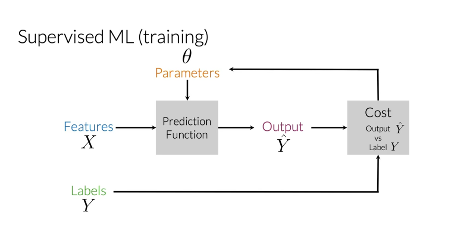

#### Sentiment Analysis

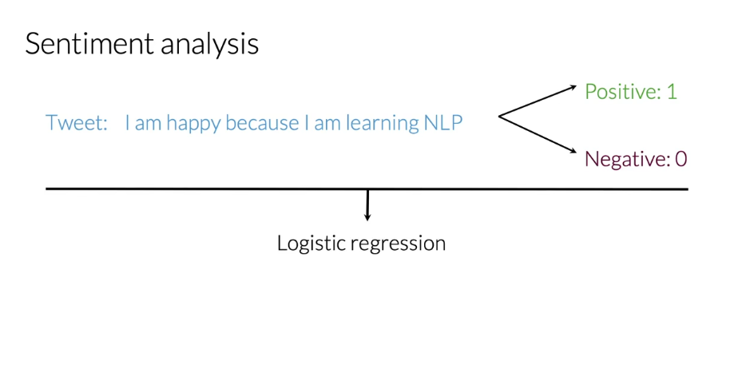

##### How to do this

1. Process the raw tweets in your training sets and extract useful features.
2. Train your logistic regression classifier while minimizing the cost.
3. Finally you'll be able to make your predictions.

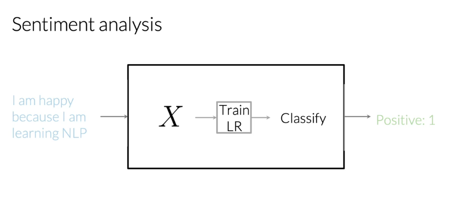

In this video, you learned about the steps required for you to classify a tweet.

### Vocabulary Feature Extraction

In this video, you will learn how to represent a text as a vector.

#### Vocabulary

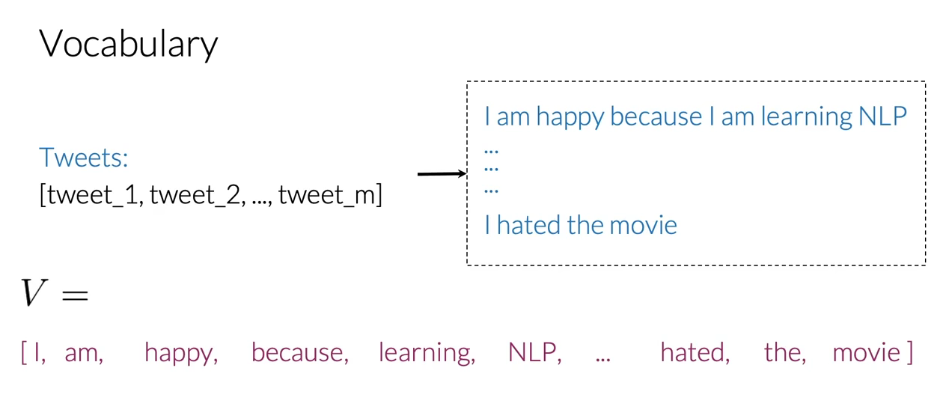

#### Feature Extraction

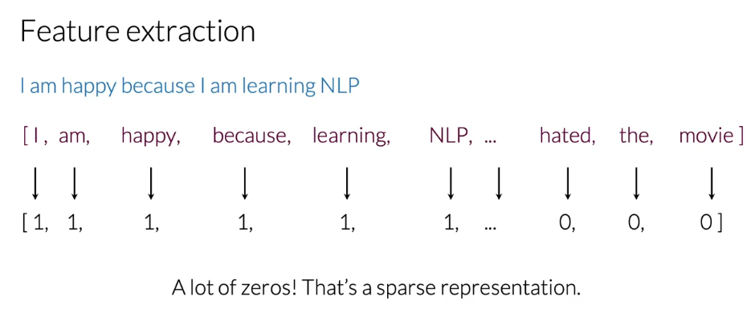

- If it appears, you'd assign a value of 1;
- If it doesn't appear, you'd assign a value of 0.

This type of representation with a small relative number of non-zero values is called a **sparse representation**（稀疏表示）.

#### Problems with sparse representations

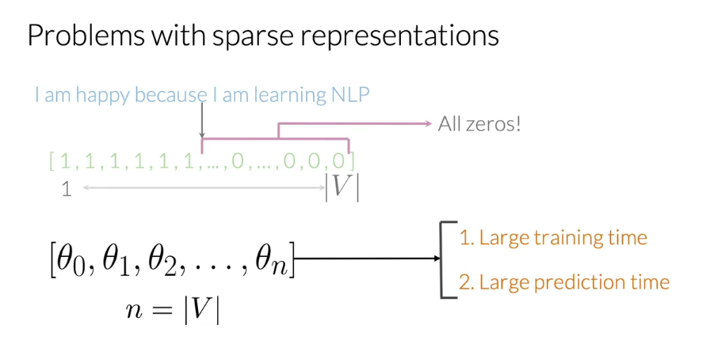

This representation would have a number of features equal to the size of your entire vocabulary. This would have a lot of features equal to 0 for every tweet. With the sparse representation, a logistic regression model would have to learn `n` plus 1 parameters, where n would be equal to the size of your vocabulary and you can imagine that for large vocabulary sizes, this would be problematic. 

### Negative and Positive Frequencies

Here for instance, you could have a **corpus**（语料库）consisting of four tweets. 

Associated with that corpus, you would have a set of unique words, your vocabulary. 

In this example, your vocabulary would have eight unique words. 

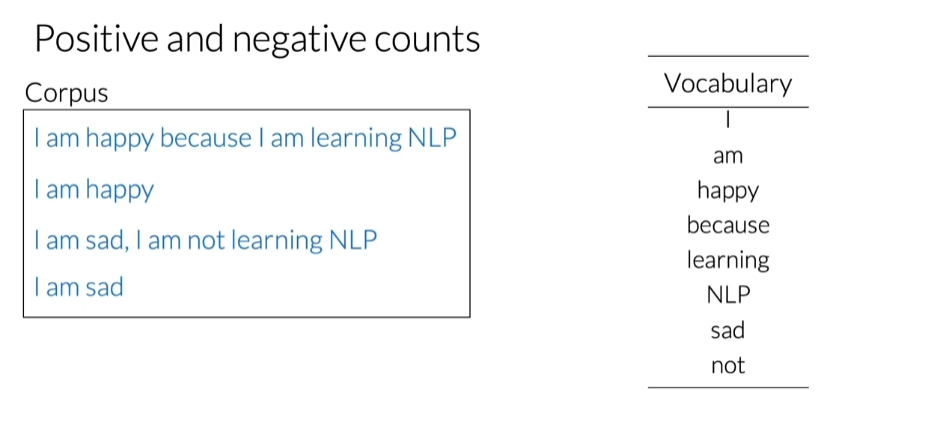

For this particular example of sentiment analysis, you have two classes. 

One class associated with positive sentiment and the other with negative sentiment. 

So taking your corpus, you'd have a set of two tweets that belong to the positive class, and the sets of two tweets that belong to the negative class. 

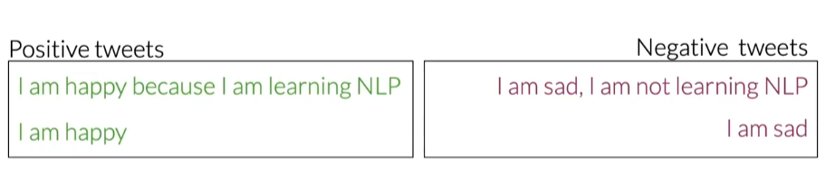

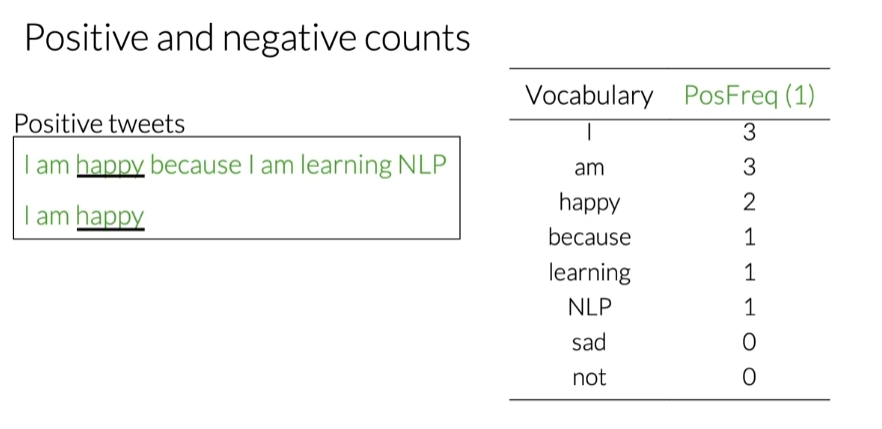

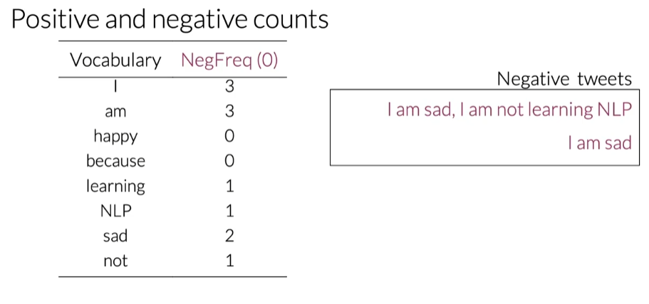

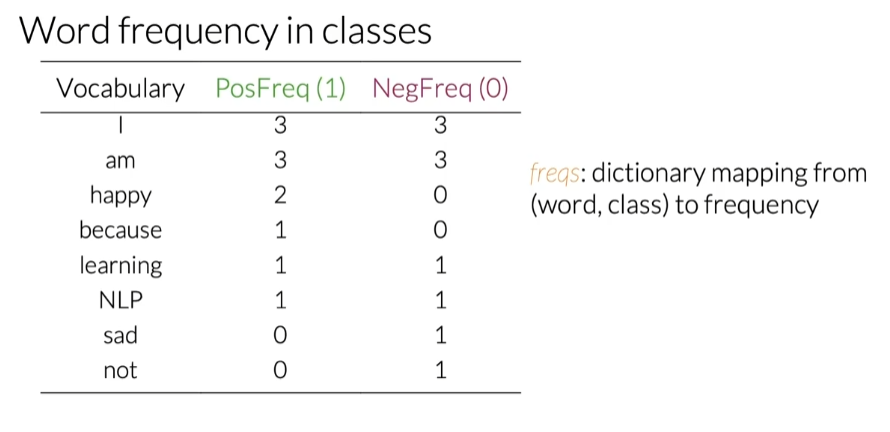

In practice when coding, this table is a dictionary mapping from a word class there to its frequency. 

So it maps the word and its corresponding class to the frequency or the number of times that's where it showed up in the class. 

### Feature Extraction with Frequencies

Your previously learned to encode a tweet as a vector of dimension V.

You will now learn to encode a tweet or specifically represented as a vector of dimension 3. 

#### Word Frequency in Classes

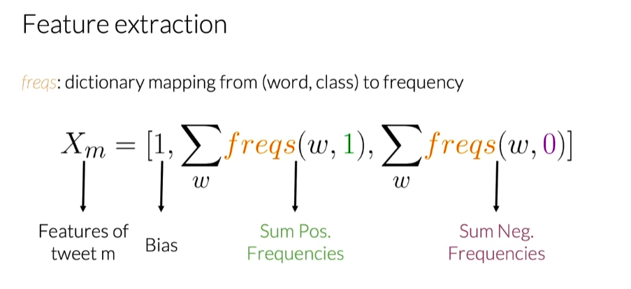

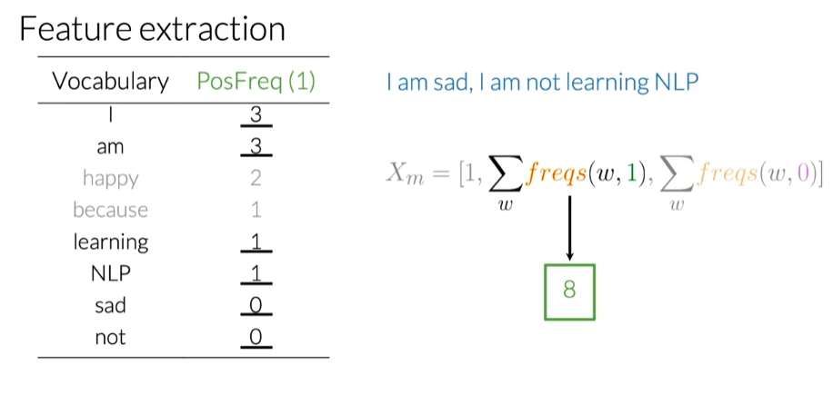

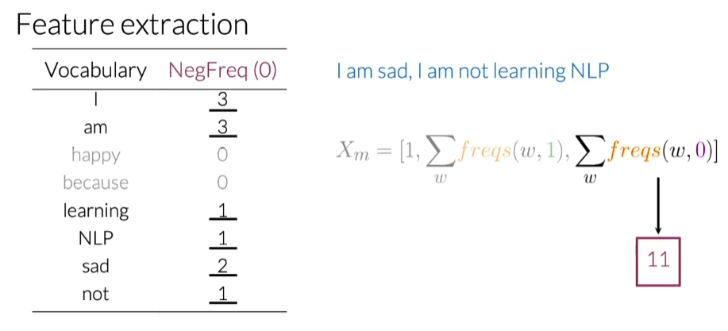

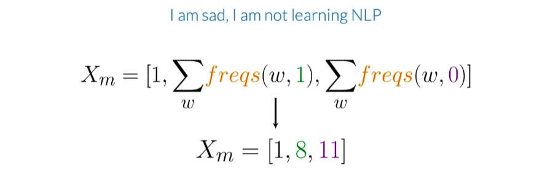

### Preprocessing

You will now learn about two major concepts of preprocessing. 

The first thing you'll learn about is called **stemming**（阻止，封堵） and the second thing you will learn about is called stop words, and specifically you will learn how to use stemming and stop words to preprocess your texts. 

