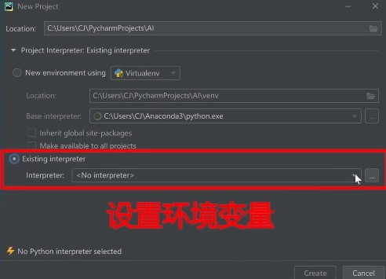

# 课程总述

[TOC]

## 课程目录

[第一讲 神经网络计算](https://github.com/SLEEPYDOG77/TensorFlow-Notes/blob/develop/%E7%AC%AC%E4%B8%80%E8%AE%B2%20%E7%A5%9E%E7%BB%8F%E7%BD%91%E7%BB%9C%E8%AE%A1%E7%AE%97.md)

> 神经网络的计算过程，搭建出你的第一个神经网络模型。

[第二讲 神经网络优化](https://github.com/SLEEPYDOG77/TensorFlow-Notes/blob/develop/%E7%AC%AC%E4%BA%8C%E8%AE%B2%20%E7%A5%9E%E7%BB%8F%E7%BD%91%E7%BB%9C%E4%BC%98%E5%8C%96.md)

> 神经网络的优化方法，掌握学习率、激活函数、损失函数和正则化的使用，用Python语言写出`SGD`、`Momentum`、`Adagrad`、`RMSProp`、`Adam`五种反向传播优化器。

[第三讲 神经网络八股](https://github.com/SLEEPYDOG77/TensorFlow-Notes/blob/develop/%E7%AC%AC%E4%B8%89%E8%AE%B2%20%E7%A5%9E%E7%BB%8F%E7%BD%91%E7%BB%9C%E5%85%AB%E8%82%A1.md)

> 神经网络搭建八股，用“六步法”，写出手写数字识别训练模型。

[第四讲 网络八股扩展](https://github.com/SLEEPYDOG77/TensorFlow-Notes/blob/develop/%E7%AC%AC%E5%9B%9B%E8%AE%B2%20%E7%BD%91%E7%BB%9C%E5%85%AB%E8%82%A1%E6%89%A9%E5%B1%95.md)

> 神经网络八股扩展，增加自制数据集、数据增强，断点续训参数提取和 `acc/loss` 可视化，实现给图识物的应用程序。

[第五讲 卷积神经网络](https://github.com/SLEEPYDOG77/TensorFlow-Notes/blob/develop/%E7%AC%AC%E4%BA%94%E8%AE%B2%20%E5%8D%B7%E7%A7%AF%E7%A5%9E%E7%BB%8F%E7%BD%91%E7%BB%9C.md)

> 卷积神经网络，用基础`CNN`、`LeNet`、`AlexNet`、`VGGNet`、`InceptionNet`和`ResNet`实现图像识别。

[第六讲 循环神经网络](https://github.com/SLEEPYDOG77/TensorFlow-Notes/blob/develop/%E7%AC%AC%E5%85%AD%E8%AE%B2%20%E5%BE%AA%E7%8E%AF%E7%A5%9E%E7%BB%8F%E7%BD%91%E7%BB%9C.md)

> 循环神经网络，用基础`RNN`、`LSTM`、`GRU`实现股票预测。


## 环境安装

### Anaconda 安装

> `Anaconda`是包含`conda`环境管理器的`Python`发行版本。

```c
conda install cudatoolkit=10.1			// 仅用于兼容的英伟达GPU
conda install cudnn=7.6					// 如报错，可忽略这两句
pip install tensorflow==2.1
```

#### （一）Anaconda下载与安装

从[Anaconda官网](www.anaconda.com)下载Python3.7版本。


按照引导安装，注意勾选**将anaconda加入环境变量**。


等待安装完成。


#### （二）TensorFlow 安装

从**开始**，打开`Anaconda Prompt`。

##### 1. 新建环境

新建一个名叫 TF2.1 的环境，用 python3.7 的版本。

```
conda create -n TF2.1 python=3.7
```


进入TF2.1环境。

```
conda create TF2.1
```


##### 2. 安装英伟达SDK

安装英伟达的SDK 10.1 版本。

```
conda install cudatoolkit=10.1
```


##### 3. 安装英伟达深度学习软件包

```
conda install cudnn=7.6
```


> 若第2、3步安装语句报错，可能是电脑硬件不支持英伟达GPU，可以跳过这两步。


##### 4. 安装 TensorFlow

```
pip install tensorflow==2.1
```


> 直接用上述语句可能下载得很慢，可以用清华的镜像。

```cmd
pip install tensorflow==2.1 -i https://pypi.tuna.tsinghua.edu.cn/simple/
```

> 也可以使用别的镜像路径下载。
>
> - 阿里云：http://mirrors.aliyun.com/pypi/simple/
> - 中国科技大学：https://pypi.mirrors.ustc.edu.cn/simple/
> - 中国科学技术大学：http://pypi.mirrors.ustc.edu.cn/simple/
> - 清华大学：https://pypi.tuna.tsinghua.edu.cn/simple/


##### 5. 验证安装

进入Python验证安装是否成功。

```
python
```


```
import tensorflow as tf
tf.__version__
```

如果显示 2.1.0 说明安装成功了。


### `Pycharm` 安装

> `Pycharm`是一个Python IDE，也就是Python集成开发环境。

#### （一）下载和安装`Pycharm`

从[PyCharm官网](http://www.jetbrains.com/pycharm/download/#section=windows)下载集成开发环境 `Pycharm`。


左边的三个选项根据需求选择。


右边更新环境变量选项，需要选上。


安装完成后，**重启电脑**。


#### （二）`PyCharm` 环境配置

##### 1. 打开`PyCharm`

##### 2. 新建工程


##### 3. 设置工程路径


##### 4. 设置环境变量



用刚刚配置好的 `conda` 环境。


选择 TF2.1 中的 Python 作为解释器。


> 这一步可能会不知道刚配置Python3.7版本在哪个路径下。
>
> 可以打开anaconda prompt，进入TF2.1环境
>
> ```
> conda activate TF2.1
> where python
> ```
>
> 即可看到电脑中所有的Python所在路径。
>
> 查找 conda.exe 路径同理，在anaconda prompt中输入 `where conda` 即可。
>
> ```
> conda activate TF2.1
> where conda
> ```

配置好后新建工程。


##### 5. 新建文件


输入测试代码。

```python
import tensorflow as tf

tensorflow_version = tf.__version__
gpu_available = tf.test.is_gpu_available()

print("tensorflow version:", tensorflow_version, "\tGPU available:", gpu_available)

a = tf.constant([1.0, 2.0], name="a")
b = tf.constant([1.0, 2.0], name="b")
result = tf.add(a, b, name="add")
print(result)
```


点击右键，选择run。


若出现 `tf.tensor`，则表示开发环境安装成功。


