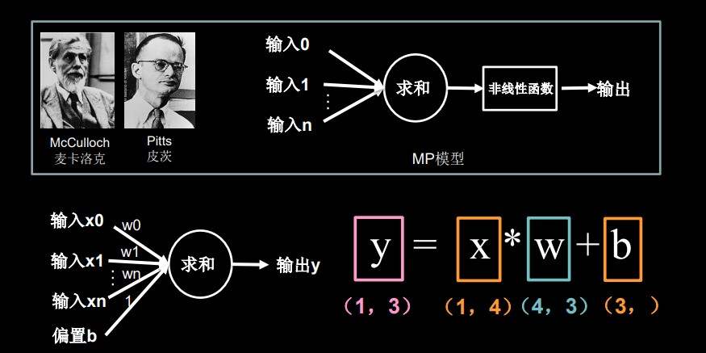
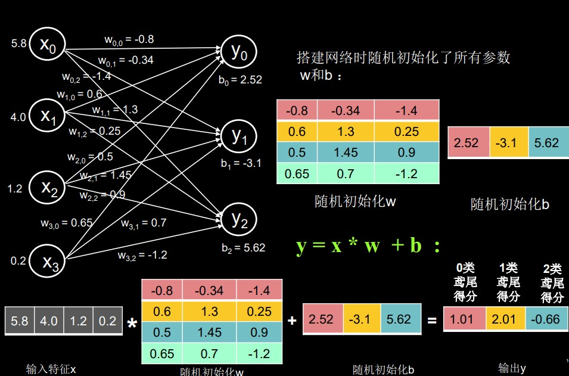
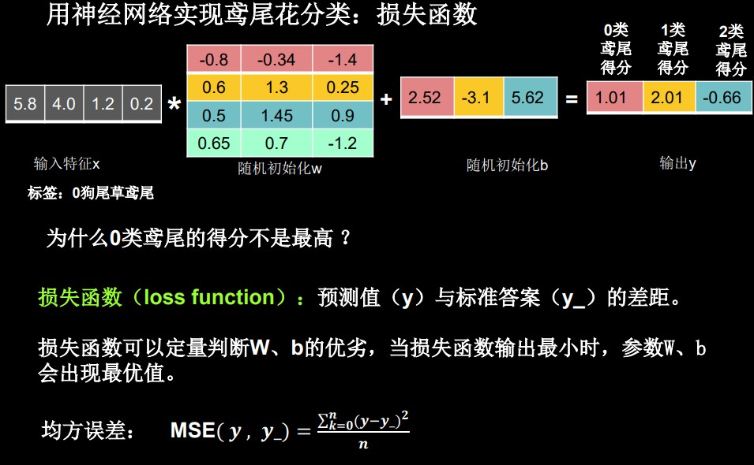
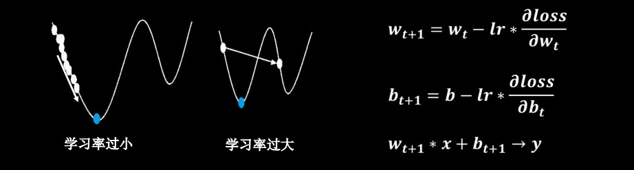
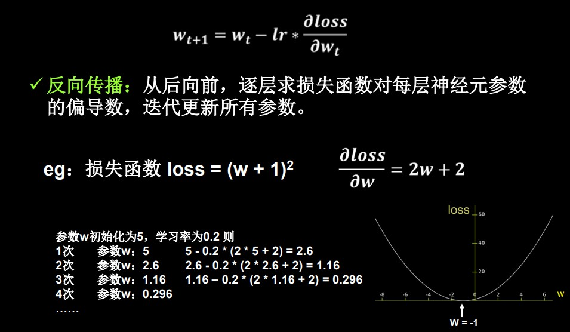
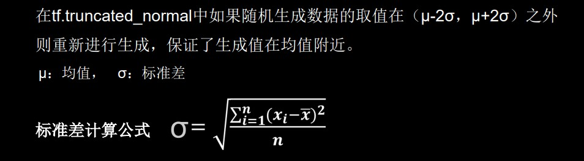
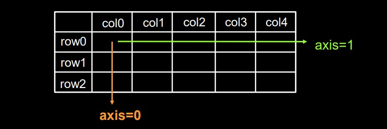
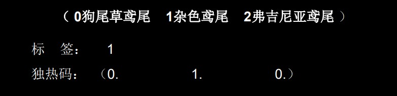
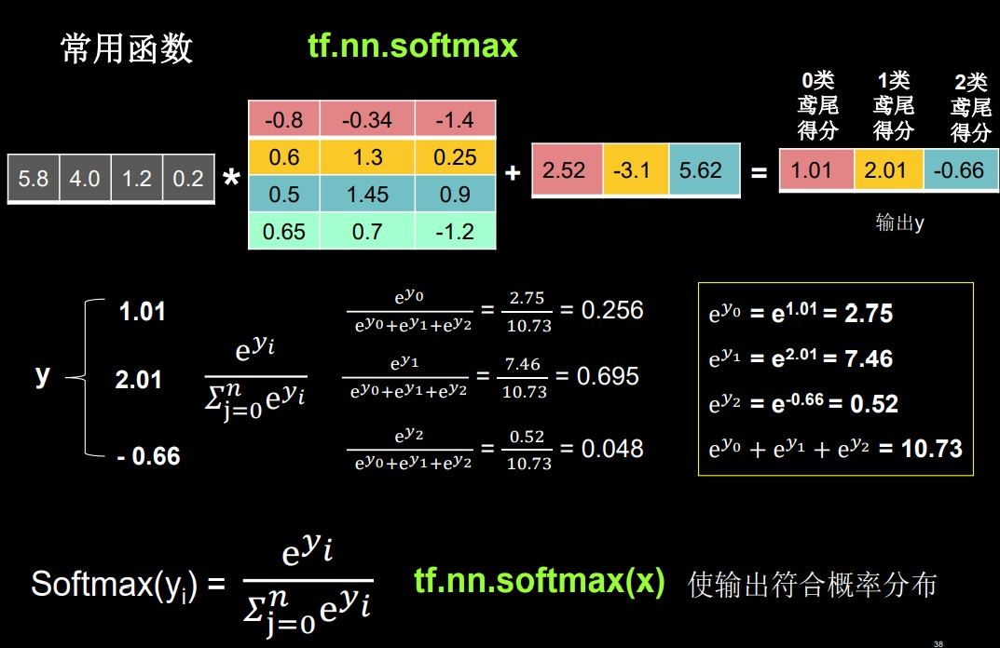

# 第一讲 神经网络计算

[TOC]

## 本讲目标

- 学会神经网络计算过程
- 使用基于TF2原生代码搭建你的第一个神经网络训练模型


## 章节目录

- 当今人工智能主流方向 —— 连接主义
- 前向传播
- 损失函数
- 梯度下降
- 学习率
- 反向传播更新参数
- TensorFlow2 常用函数


## 人工智能三学派

| 学派         | 定义                                                         | 备注                                               |
| ------------ | ------------------------------------------------------------ | -------------------------------------------------- |
| **行为主义** | **基于控制论**，构建感知 - 动作控制系统。                    | （控制论，如平衡、行走、避障等**自适应控制系统**） |
| **符号主义** | **基于算术逻辑表达式**，求解问题时先把问题描述为表达式，再求解表达式。 | （可用公式描述、实现**理性思维**，如专家系统）     |
| **连接主义** | 仿生学，**模仿神经元连接关系**。                             | （仿脑神经元连接，实现**感性思维**，如神经网络）   |

当今人工智能主流方向 —— **连接主义**。


## 神经网络设计过程

| 步骤         | 操作                                                     |
| ------------ | -------------------------------------------------------- |
| **准备数据** | 采集大量 “特征/标签” 数据                                |
| **搭建网络** | 搭建神经网络结构                                         |
| **优化参数** | 训练网络获取最佳参数（反传）                             |
| **应用网络** | 将网络保存为模型，输入新数据，输出分类或预测结果（前传） |


### 以鸢尾花分类为例

鸢尾花分为三类：0-狗尾鸢尾花、1-杂色鸢尾、2-弗吉尼亚鸢尾，给计算机一张鸢尾花图片，计算机如何判断是哪类鸢尾花？

> 人们通过经验总结出了规律：通过测量花的花萼长、花萼宽、花瓣长、花瓣宽，可以得出鸢尾花的类别。
>
> （如：花萼长 > 花萼宽 且 花瓣长 / 花瓣宽 > 2，则为 1-杂色鸢尾）

此时，很容易想到的思路是用 **if-else** 或 **case** 语句。这便是**专家系统**，即把专家的经验告知计算机，计算机执行**逻辑判别**（理性计算），给出分类。


而**神经网络**方法则是通过：

- 采集大量（花萼长、花萼宽、花瓣长、花瓣宽，对应的类别）数据对构成**数据集**。
- 把数据集喂入搭建好的神经网络结构，网络优化参数得到**模型**。
- 模型读入新输入特征，输出**识别结果**。


### MP模型

> 1943年，心理学家 `W.S.McCulloch` 和数理逻辑学家 `W.Pitts` 建立了神经网络和数学模型，称为MP模型。他们通过MP模型提出了神经元的形式化数学描述和网络结构方法，证明了单个神经元能执行逻辑功能，从而开创了人工神经网络研究的时代。




（简化中间非线性函数的部分所得公式）


**以鸢尾花分类为例，**

- 四个输入节点 x0、x1、x2、x3（花萼长、花萼宽、花瓣长、花瓣宽）
- 三个输出节点 y0、y1、y2（三种鸢尾花的分类可能性大小）
- 中间连线四行三列，每根连线上有权重 w
- 每一个神经元有一个偏置项 b0、b1、b2


### 前向传播




### 损失函数



观察输出y与标签，发现并不一致，是因为一开始的权重w与偏置项b是随机定义的。

因此需要用到**损失函数**来定量分析预测值与标准答案之间的差距，以此来找寻w、b的最优值。


### 梯度下降

目的：想找到一组参数 w 和 b，使得损失函数最小。

梯度：函数对各参数求偏导后的向量。（函数梯度下降方向是函数减小方向）

**梯度下降法：沿损失函数梯度下降的方向，寻找损失函数的最小值，得到最优参数的方法。**

**学习率（Learning rate，lr）：**是一个超参数。

- 当学习率设置的过小时，收敛过程将变得十分缓慢。
- 当学习率设置的过大时，梯度可能会在最小值附近来回振荡，甚至可能无法收敛。




### 反向传播

反向传播：从后向前，逐层求损失函数对每层神经元参数的偏导数，迭代更新所有参数。




## TensorFlow基础

### 什么是Tensor（张量）

张量（Tensor）：多维数组（列表）

阶：张量的维数

> 张量可以表示 0阶 到 n阶数组（列表）。


### 数据类型

```python
#32位整型
tf.int32
#32位浮点型
tf.float32
#64位浮点型
tf.float64

#布尔型
tf.constant([True, False])

#字符串型
tf.constant("Hello World!")
```


### 创建一个Tensor

```python
#tf.constant(张量内容， dtype=数据类型(可选))

import tensorflow as tf
a = tf.constant([1,5], dtype = tf.int64)
print(a)
#打印出a的数据类型
print(a.dtype)
#打印出a的形状
print(a.shape)
```

输出结果

```python
<tf.Tensor([1,5], shape(2,), dtype=int64)
<dtype:'int64'>
(2,)
```

> Tensor的形状，shape括号中逗号隔开了几个数字，则为几维张量。
>
> 如 shape(2, )，即为二维张量，其中包含两个元素 1 和 5。


#### 将 `numpy` 的数据类型转换为Tensor数据类型

```python
#tf.convert_to_tensor(数据名，dtype=数据类型(可选))

import tensorflow as tf
import numpy as np
a = np.arange(0,5)
b = tf.convert_to_tensor(a, dtype = tf.int64)
print(a)
print(b)
```

输出结果

```python
[0 1 2 3 4]
tf.Tensor([0 1 2 3 4], shape=(5, ), dtype=int64)
```


#### 创建特殊的Tensor

```python
#创建全为0的三维张量
tf.zeros(3)

#创建全为1的三维张量
tf.ones(3)

#创建全为指定值6的七维张量
tf.fill(7,6)

a = tf.zeros([2,3])
b = tf.ones(4)
c = tf.fill([2,2],9)
print(a)
print(b)
print(c)
```

维度的写法：

- 一维 直接写个数
- 二维 用 [行，列]
- 多维 用 [n, m, j, k.....]


#### 生成正态分布的随机数

```python
#tf.random.normal(维度，mean = 均值，stddev = 标准差)

d = tf.random.normal([2,2], mean=0.5, stddev = 1)
print(d)
```


#### 生成截断式正态分布的随机数

```python
#tf.random.truncated_normal(维度，mean = 均值，stddev = 标准差)

e = tf.random.truncated_normal([2,2], mean=0.5, stddev = 1)
print(e)
```




#### 生成均匀分布随机数

```python
#tf.random.uniform(维度，minval = 最小值，maxval = 最大值)
#[minval,maxval) 前闭后开区间
f = tf.random.uniform([2,2], minval = 0, maxval = 1)
print(f)
```


### 常用函数

```python
#强制tensor转换为该数据类型
#tf.cast(张量名, dtype=数据类型)

#计算张量维度上元素的最大值
#tf.reduce_min(张量名)

#计算张量维度上元素的最大值
#tf.reduce_max(张量名)

x1 = tf.constant([1., 2., 3.], dtype=tf.float64)
print(x1)

x2 = tf.cast(x1, tf.int32)
print(x2)

print(tf.reduce_min(x2), tf.reduce_max(x2))
```


#### axis的用法

在一个二维张量或数组中，可以通过调整axis等于0或1控制执行维度。

- axis = 0 代表跨行（经度，down）
- axis = 1 代表跨列（纬度，across）
- 不指定axis，则所有元素参与计算




```python
#计算张量沿着指定维度的平均值
#tf.reduce_mean(张量名，axis = 操作轴)

#计算张量沿着指定维度的和
#tf.reduce_sum(张量名，axis = 操作轴)

x = tf.constant([[1,2,3],[2,2,3]])
print(x)
print(tf.reduce_mean(x))
print(tf.reduce_sum(x, axis = 1))
```


#### 标记为可训练

`tf.Variable()` 将变量标记为 “可训练”，被标记的变量会在反向传播中记录梯度信息。

神经网络训练中，常用该函数标记待训练参数。

```python
#tf.Variable(初始值)

w = tf.Variable(tf.random.normal([2,2], mean = 0, stddev = 1))
```


#### 常用数学运算

```python
#加 tf.add(张量1，张量2)
#减 tf.subtract(张量1，张量2)
#乘 tf.multiply(张量1，张量2)
#除 tf.divide(张量1，张量2)

a = tf.ones([1,3])
b = tf.fill([1,3], 3.)
print(a)
print(b)
print(tf.add(a,b))
print(tf.substract(a,b))
print(tf.multiply(a,b))
print(tf.divide(b,a))
```

只有维度相同的张量才可以做四则运算。


```python
#平方 tf.square(张量名)
#次方 tf.pow(张量名，n次方数)
#开方 tf.sqrt(张量名)

a = tf.fill([1,2],3.)
print(a)
print(tf.pow(a,3))
print(tf.square(a))
print(tf.sqrt(a))
```


```python
#矩阵乘 tf.matmul(矩阵1，矩阵2)

a = tf.ones([3,2])
b = tf.fill([2,3],3.)
print(tf.matmul(a,b))
```


#### 切分维度

切分传入张量的第一维度，生成输入特征/标签对，构建数据集。

> 对 `numpy` 和 `tensor` 格式都适用。

```python
#data = tf.data.Dataset.from_tensor_slices((输入特征，标签))

features = tf.constant([12,23,10,17])
labels = tf.constant([0,1,1,0])
dataset = tf.data.Dataset.from_tensor_slices((features, labels))
print(dataset)
for element in dataset:
    print(element)
```


#### 求导运算

with 结构记录计算过程，gradient 求出张量的梯度。

```python
#with tf.GradientTape() as tape:
#	若干个计算过程
#grad = tape.gradient(函数，对谁求导)

with tf.GradientTape() as tape:
    w = tf.Variable(tf.constant(3.0))
    loss = tf.pow(w,2)
grad = tape.gradient(loss, w)
print(grad)
```

运行结果

```python
tf.Tensor(6.0, shape=(), dtype=float32)
```


#### 枚举 enumerate

enumerate是python 的内建函数，它可遍历每个元素（如列表、元组或字符串），组合为：索引 元素，常在for循环中使用。

```python
#enumerate(列表名)

seq = ['one', 'two', 'three']
for i, element in enumerate(seq):
    print(i, element)
```

输出结果

```python
0 one
1 two
2 three
```


#### 独热编码 (one-hot encoding)

在分类问题中，常用独热码做标签。

标记类别：1 - 是，0 - 非。




`tf.one_hot()` 函数将待转换数据，转换为 `one-hot` 形式的数据输出。

```python
#tf.one_hot(待转换数据，depth=几分类)

classes = 3

#输入的元素值最小为0，最大为2
labels = tf.constant([1,0,2])
output = tf.one_hot(labels, depth = classes)
print(output)
```

输出结果

```python
[[0.1.0.]
 [1.0.0.]
 [0.0.1.]], shape=(3,3), dtype=float32
```


#### 使输出符合概率分布

```python
tf.nn.softmax(x)
```

当 n 分类的 n 个输出通过 `softmax()` 函数，便符合概率分布了。即概率和为1。



```python
y = tf.constant([1.01, 2.01, -0.66])
y_pro = tf.nn.softmax(y)
print("After softmax, y_pro is:", y_pro)
```


#### 自减操作

赋值操作，更新参数的值并返回。

调用 `assign_sub` 前，先用 `tf.Variable` 定义变量 w 为可训练（可自更新）.

```python
#w.assign_sub(w要自减的内容)

#定义变量w为可训练，初始值为4
w = tf.Variable(4)
#自减操作，即 w-=1
w.assign_sub(1)
print(w)
```


#### 返回最大值的索引（argmax）

返回张量沿指定维度最大值的索引。

```python
#tf.argmax(张量名，axis = 操作轴)

import numpy as np
test = np.array([[1,2,3],[2,3,4],[5,4,3],[8,7,2]])
print(test)
#返回每一列最大值的索引
print(tf.argmax(test, axis=0))
#返回每一行最大值的索引
print(tf.argmax(test, axis=1))
```


## 鸢尾花分类的实现

#### 鸢尾花数据集（Iris）介绍

> 共有数据150组，每组包括花萼长、花萼宽、花瓣长、花瓣宽4个输入特征。
>
> 同时给出了，这一组特征对应的鸢尾花类别。
>
> 类别包括狗尾草鸢尾（Setosa Iris）、杂色鸢尾（Versicolour Iris）、弗吉尼亚鸢尾（Virginica Iris）三类，分别用数字0、1、2表示。


#### 从 `sklearn` 包 `datasets` 读入数据集

```python
from sklearn.datasets import load_iris
#返回iris数据集所有输入特征
x_data = datasets.load_iris().data
#返回iris数据集所有标签
y_data = datasets.load_iris().target
```

完整可运行代码

```python
from sklearn import datasets
from pandas import DataFrame
import pandas as pd

x_data = datasets.load_iris().data  # .data返回iris数据集所有输入特征
y_data = datasets.load_iris().target  # .target返回iris数据集所有标签
print("x_data from datasets: \n", x_data)
print("y_data from datasets: \n", y_data)

x_data = DataFrame(x_data, columns=['花萼长度', '花萼宽度', '花瓣长度', '花瓣宽度']) # 为表格增加行索引（左侧）和列标签（上方）
pd.set_option('display.unicode.east_asian_width', True)  # 设置列名对齐
print("x_data add index: \n", x_data)

x_data['类别'] = y_data  # 新加一列，列标签为‘类别’，数据为y_data
print("x_data add a column: \n", x_data)

#类型维度不确定时，建议用print函数打印出来确认效果
```

> 需用 pip 安装 sklearn、pandas 库。


#### 神经网络实现鸢尾花分类的步骤

| 步骤                  | 具体操作                                                     |
| --------------------- | :----------------------------------------------------------- |
| **准备数据**          | 1. 数据集读入 2. 数据集乱序 3. 生成训练集和测试集 4. 配成（输入特征， 标签）对，每次读入一小撮（batch） |
| **搭建网络**          | 定义神经网络中所有可训练参数                                 |
| **参数优化**          | 嵌套循环迭代，with 结构更新参数，显示当前 `loss`             |
| **测试效果**          | 计算当前参数前向传播后的准确率，显示当前 `acc`               |
| **`acc/loss` 可视化** | /                                                            |


#### 代码实现

```python
#数据集读入
from sklearn.datasets import datasets
x_data = datasets.load_iris().data
y_data = datasets.load_iris().target

#数据集乱序
np.random.seed(116)
np.random.shuffle(x_data)
np.random.seed(116)
np.random.shuffle(y_data)
np.random.set_seed(116)

#数据集分出永不相见的训练集和测试集
x_train = x_data[:-30]
y_train = y_data[:-30]
x_test = x_data[-30:]
y_test = y_data[-30:]

#配成[输入特征，标签]对，每次喂入一小撮（batch）
train_db = tf.data.Dataset.from_tensor_slices((x_train, y_train)).batch(32)
test_db = tf.data.Dataset.from_tensor_slices((x_test, y_test)).batch(32)

#定义神经网络中所有可训练参数
w1 = tf.Variable(tf.random.truncated_normal([4,3], stddev=0.1, seed=1))
b1 = tf.Variable(rf.random.truncated_normal([3], stddev=0.1, seed=1))

#嵌套循环迭代，with 结构更新参数，显示当前 loss
#数据集级别迭代
for epoch in range(epoch):
    #batch级别迭代
    for step, (x_train, y_train) in enumerate(train_db):
        #记录梯度信息
        with tf.GradientTape() as tape:
            #前向传播计算y
            #计算总loss
        grads = tape.gradient(loss, [w1,b1])
        #参数自更新
        w1.assign_sub(lr* grads[0])
        b1.assign_sub(lr* grads[1])
     print("Epoch{}, loss:{}".format(epoch, loss_all/4))
    
#计算当前参数向前传播后的准确率，显示当前acc
for x_test, y_test in test_db:
    y = tf.matmul(h, w) + b
    y = tf.nn.softmax(y)
    pred = tf.argmax(y, axis=1)
    pred = tf.cast(pred, dtype=y_test.dtype)
    correct = tf.cast(tf.equal(pred, y_test), dtype=tf.int32)
    correct = tf.reduce_sum(correct)
    total_correct += int(correct)
    total_number += x_test.shape[0]
acc = total_correct / total_number
print("test_acc:", acc)
```


